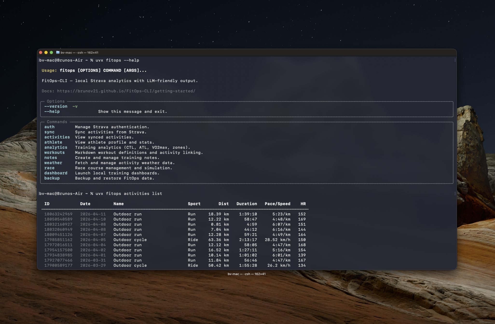

# fitops activities

Browse and query synced activities.

Output is a formatted table by default. Add `--json` to any command for raw JSON output (useful for scripting or AI agents).

## Commands

### `fitops activities list`

List recent activities with full metrics.

```bash
fitops activities list [OPTIONS]
```

**Options:**

| Flag | Default | Description |
|------|---------|-------------|
| `--sport TYPE` | all | Filter by sport type (e.g. `Run`, `Ride`, `Swim`) |
| `--limit N` | 20 | Max number of activities to return |
| `--offset N` | 0 | Skip the first N results (use with `--limit` to page through results) |
| `--after DATE` | — | Filter activities after this date (YYYY-MM-DD) |
| `--before DATE` | — | Filter activities before this date (YYYY-MM-DD) |
| `--search TEXT` | — | Case-insensitive substring match on activity name/title |
| `--tag TAG` | — | Filter by tag: `race`, `trainer`, `commute`, `manual`, `private` |
| `--json` | false | Output raw JSON instead of the formatted table |

**Examples:**

```bash
fitops activities list
fitops activities list --sport Run --limit 10
fitops activities list --after 2026-01-01
fitops activities list --after 2025-12-01 --before 2026-01-01   # date range
fitops activities list --sport Ride --limit 5 --after 2025-12-01
fitops activities list --search "Morning Run"                   # title search
fitops activities list --tag race                               # races only
fitops activities list --tag trainer                            # indoor trainer rides
fitops activities list --sport Run --json          # JSON for scripting or agents
fitops activities list --sport Run --limit 20 --offset 20       # page 2
```

**Pagination (JSON mode):**

When using `--json`, the `_meta` envelope includes pagination fields so agents can detect when more results exist:

```json
{
  "_meta": {
    "total_count": 150,
    "returned_count": 20,
    "offset": 0,
    "has_more": true
  }
}
```

To page through all results, increment `--offset` by `--limit` until `has_more` is `false`.

**Supported tag values:**

| Tag | Matches |
|-----|---------|
| `race` | Activities with Strava workout_type = 1 (race) |
| `trainer` | Indoor trainer sessions |
| `commute` | Commute activities |
| `manual` | Manually entered activities |
| `private` | Private activities |

See [Output Examples → Activities](../output-examples/activities.md) for sample output.



---

### `fitops activities get <ID>`

Get detailed info for a single activity.

```bash
fitops activities get 12345678901 [OPTIONS]
```

**Arguments:**

| Argument | Description |
|----------|-------------|
| `ID` | Strava activity ID (required) |

**Options:**

| Flag | Default | Description |
|------|---------|-------------|
| `--fresh` | false | Re-fetch detail from Strava API (bypasses local cache) |
| `--splits` | false | Print a per-km splits table (runs only, requires streams) |
| `--workout` | false | Print focused workout plan + compliance view |
| `--chart` | false | Render an ASCII time-series chart in the terminal |
| `--stream STREAM` | `heartrate` | Stream to plot when `--chart` is set (see table below) |
| `--x-axis VALUE` | `time` | Chart x-axis: `time` or `distance` |
| `--from N` | — | Zoom window start (seconds or metres) |
| `--to N` | — | Zoom window end (seconds or metres) |
| `--width N` | auto | Chart width in characters |
| `--height N` | `20` | Chart height in rows |
| `--resolution N` | auto | Number of data buckets (lower = smoother) |
| `--json` | false | Output raw JSON instead of formatted output |

Flags can be combined: `--workout --splits` shows per-km splits segmented by workout intervals.

**Chart streams:**

| Stream | Display | Notes |
|--------|---------|-------|
| `heartrate` | Heart Rate (bpm) | |
| `pace` / `velocity_smooth` | Pace (min/km) | Y-axis inverted: faster = higher |
| `speed` | Speed (km/h) | Auto-selected for cycling when `velocity_smooth` is requested |
| `gap` | Grade Adj. Pace (min/km) | Derived — requires `velocity_smooth` + `grade_smooth` |
| `wap` | Weighted Avg Pace (min/km) | Derived — 30-sample rolling mean of pace |
| `true_pace` | True Pace (min/km) | Derived — GAP + weather-adjusted pace (most accurate effort metric) |
| `altitude` | Altitude (m) | |
| `cadence` | Cadence (spm) | |
| `watts` | Power (W) | |
| `distance` | Distance (m) | |

**Examples:**

```bash
# Full detail view
fitops activities get 17985851162

# Per-km splits table
fitops activities get 17985851162 --splits

# Workout plan compliance + segment detail
fitops activities get 17985851162 --workout

# Workout splits segmented by intervals
fitops activities get 17985851162 --workout --splits

# ASCII heart rate chart
fitops activities get 17985851162 --chart

# True pace chart over distance
fitops activities get 17985851162 --chart --stream true_pace --x-axis distance

# Zoom into km 5–10
fitops activities get 17985851162 --chart --stream heartrate --x-axis distance --from 5000 --to 10000

# JSON for scripting / agents
fitops activities get 17985851162 --json
```

**JSON output shape (for agents and scripting):**

When `--json` is used, the output is a single activity object enriched with all analytics available in the dashboard. Top-level keys:

| Key | Type | Description |
|-----|------|-------------|
| `strava_activity_id` | int | Strava activity ID |
| `name` | string | Activity title |
| `sport_type` | string | e.g. `"Run"`, `"Ride"` |
| `start_date_local` | string | Local datetime of start |
| `timezone` | string | IANA timezone (e.g. `"Europe/London"`) |
| `duration` | object | `moving_time_seconds`, `moving_time_formatted`, `elapsed_time_seconds`, `elapsed_time_formatted`, `efficiency_pct` |
| `distance` | object | `km` |
| `pace` | object\|null | `average_per_km`, `average_per_mile` (runs only) |
| `speed` | object | `average_kmh`, `max_kmh` |
| `elevation` | object | `total_gain_m` |
| `heart_rate` | object\|null | `average_bpm`, `max_bpm` |
| `cadence` | object\|null | `average_spm` |
| `power` | object\|null | `average_watts`, `max_watts`, `weighted_average_watts` (rides only) |
| `training_metrics` | object | `suffer_score`, `calories`, `training_stress_score` |
| `equipment` | object | `gear_id`, `gear_name`, `gear_type` |
| `description` | string\|null | Activity description (whitespace-trimmed) |
| `device_name` | string\|null | Recording device (e.g. `"Garmin Forerunner 965"`) |
| `flags` | object | `trainer`, `commute`, `manual`, `private`, `is_race` (only keys that are `true` are included) |
| `social` | object | `kudos`, `comments` (omitted when both are 0) |
| `data_availability` | object | `has_gps`, `has_heart_rate`, `has_power`, `streams_fetched`, `laps_fetched`, `detail_fetched` |
| `insights` | object | See **Insights block** below |
| `analytics` | object\|null | See **Analytics block** below (requires streams) |
| `km_splits` | array\|null | Per-km splits (runs only, requires streams) — see **km_splits** below |
| `avg_gap` | string\|null | Average grade-adjusted pace, e.g. `"4:52/km"` (runs only, requires streams) |
| `laps` | array\|null | Lap-by-lap breakdown (requires laps fetched) — see **laps** below |
| `weather` | object\|null | Weather conditions + pace adjustments (requires weather fetch) — see **weather** below |
| `performance_insights` | array\|null | Detected new records or metric changes (requires streams) — see **performance_insights** below |
| `workout` | object\|null | Linked workout plan + compliance (if workout was linked) — see **workout** below |

#### Insights block

```json
"insights": {
  "aerobic_training_score": 3.8,
  "aerobic_label": "Strong aerobic stimulus",
  "anaerobic_training_score": 2.1,
  "anaerobic_label": "Moderate anaerobic load",
  "hr_drift": {
    "decoupling_pct": 4.2,
    "first_half_ratio": 0.98,
    "second_half_ratio": 1.02
  }
}
```

`hr_drift` is only present when HR + velocity streams are available.

Aerobic/anaerobic score labels:

| Score range | Aerobic label | Anaerobic label |
|-------------|--------------|-----------------|
| ≥ 4.5 | Exceptional aerobic session | Race-intensity effort |
| ≥ 3.5 | Strong aerobic stimulus | Hard anaerobic session |
| ≥ 2.5 | Solid aerobic base work | Significant threshold stress |
| ≥ 1.5 | Moderate aerobic benefit | Moderate anaerobic load |
| ≥ 0.5 | Light aerobic stimulus | Light anaerobic stimulus |
| < 0.5 | Minimal aerobic benefit | Minimal anaerobic stress |

#### Analytics block

Requires streams to be fetched. Contains HR and pace time-in-zone breakdowns:

```json
"analytics": {
  "hr_zones": [
    { "zone": 1, "name": "Recovery", "min_bpm": 100, "max_bpm": 130, "time_s": 600, "time_fmt": "10:00", "pct": 12 }
  ],
  "pace_zones": [
    { "zone": 1, "name": "Easy", "min_pace": "6:00", "max_pace": "7:30", "time_s": 1800, "time_fmt": "30:00", "pct": 50 }
  ],
  "lt2_bpm": 165,
  "vo2max": 52.4
}
```

#### km_splits

Per-km breakdown (runs only, requires streams):

```json
"km_splits": [
  { "km": 1, "label": "1", "partial": false, "pace": "4:52", "pace_s": 292.0, "avg_true_pace": "4:58/km", "avg_hr": 155, "avg_cad": 174, "elev_gain": 8, "elev_loss": 2 },
  { "km": 5, "label": "5 (0.32km)", "partial": true, "pace": "4:45", "pace_s": 285.0, "avg_true_pace": null, "avg_hr": 162, "avg_cad": 176, "elev_gain": 3, "elev_loss": 0 }
]
```

The last split is marked `"partial": true` when the final km is incomplete. `avg_true_pace` is `null` when no `true_pace` stream data is available (e.g., no weather data). `elev_loss` is the total descent in metres for the km segment.

#### laps

```json
"laps": [
  { "index": 1, "name": "Lap 1", "moving_time_s": 360, "distance_km": 1.0, "pace": "6:00/km", "pace_s": 360.0, "avg_hr": 148, "max_hr": 158, "avg_watts": null }
]
```

#### weather

```json
"weather": {
  "temperature_c": 22.0,
  "apparent_temp_c": 21.0,
  "humidity_pct": 65.0,
  "wind_speed_ms": 3.5,
  "wind_speed_kmh": 12.6,
  "wind_direction_deg": 270.0,
  "wind_dir_compass": "W",
  "precipitation_mm": 0.0,
  "wbgt_c": 18.4,
  "wbgt_flag": "yellow",
  "pace_heat_factor": 1.03,
  "condition": "Partly cloudy",
  "temp_fmt": "22°C",
  "wap_factor": 1.038,
  "wap_factor_pct": 3.8,
  "wap_fmt": "5:02/km",
  "true_pace_fmt": "5:05/km",
  "course_bearing": 214.0,
  "hr_heat_pct": 2.1,
  "hr_heat_bpm": 3,
  "source": "open-meteo"
}
```

WBGT heat flags: `"green"` (< 18 °C) / `"yellow"` (18–23 °C) / `"red"` (23–28 °C) / `"black"` (> 28 °C).

`wap_factor` > 1 means conditions were harder than neutral. `wap_fmt` is the weather-adjusted equivalent pace at neutral conditions.

#### performance_insights

Detected new records or significant metric changes:

```json
"performance_insights": [
  {
    "metric": "max_hr",
    "label": "New max heart rate detected",
    "setting_key": "max_hr",
    "current_value": 188,
    "detected_value": 192,
    "delta_pct": 2.1,
    "action": "update",
    "detected_fmt": "192 bpm",
    "current_fmt": "188 bpm",
    "unit": "bpm",
    "explanation": "This run reached a higher heart rate than your stored max."
  }
]
```

#### workout

Present only when a workout plan was linked to this activity via `fitops workouts link`:

```json
"workout": {
  "id": "threshold-tuesday",
  "name": "Threshold Tuesday",
  "compliance_score": 0.87,
  "compliance_pct": 87,
  "segments": [
    { "name": "Warm-up", "duration_s": 600, "compliance_pct": 95, ... }
  ]
}
```

---

## Sport Type Values

Common Strava sport types: `Run`, `TrailRun`, `Ride`, `VirtualRide`, `Swim`, `Walk`, `Hike`, `WeightTraining`, `Yoga`, `Workout`

## See Also

- [Output Examples → Activities](../output-examples/activities.md) — sample output
- [`fitops sync run`](./sync.md) — fetch activities from Strava

← [Commands Reference](./index.md)
