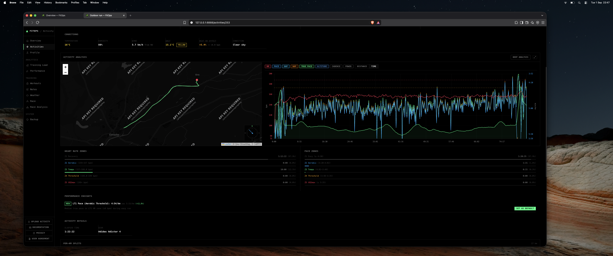

# Dashboard — Activities

The Activities page (`/activities`) is your full training history in one place, including both Strava-synced and locally imported sessions.

## Uploading GPX or TCX

Choose **Upload Activity** to open `/activities/import`. Select an original GPX or TCX recording, optionally provide a title and description, and either let FitOps detect the sport or choose an override. You can also choose shoes or a bike from the active profile's **Gear** list. **Post to Strava after import** is selected by default. FitOps processes the summary, streams, laps, training scores, VO2max/running-power inputs, training-load snapshot, and race-plan matching, builds the stamp, and then uploads the selected file through the configured headless browser session.

The selected gear is stored on the local activity. When posting is enabled, FitOps selects the same named item in Strava's upload editor. If the list is empty, add gear from Profile while offline or sync the profile's equipment from Strava.

Selecting a file immediately suggests its title and sport from the filename. A leading recording date is removed, so `20260808Outdoor run.tcx` becomes **Outdoor run** / **Run**, while `20260807Outdoor cycle.tcx` becomes **Outdoor cycle** / **Ride**. You can edit either suggestion before importing; FitOps preserves manual changes.

When the title is blank, FitOps uses **Outdoor run** for a run or **Outdoor cycle** for a ride. It then fetches weather automatically from the activity's GPS start and time. Weather, WBGT, weather-adjusted pace, course bearing, and terrain-and-weather-adjusted true pace are stored before the activity detail page opens. A temporary weather-provider failure does not discard the imported activity.

The dashboard displays a full-page progress screen while processing and posting. After Strava returns the new activity ID, FitOps links that ID locally and opens the activity page. If browser automation or Strava posting fails, the local import remains available and the page explains the failure with a link to the imported activity. Clear the checkbox when you deliberately want a local-only import.

FitOps recognizes exact re-imports and the same recording exported in both GPX and TCX. It also matches an upload to an activity already synced from Strava using its start time, sport, duration, and distance, filling missing stream data without adding a second activity. FitOps stores provenance metadata and a content hash, but does not retain another copy of the original GPX/TCX file.

The Upload Activity control is always available from the Activities page. At dashboard launch, FitOps also performs a short cached Strava health check. When Strava does not return HTTP 200, the sidebar replaces **Sync** with **Upload Activity** and hides **Streams**. A failed manual sync causes the same switch. The `/api/sync` response preserves meaningful upstream status codes such as 403 rather than returning an unrelated 500.

## The Activity List

Every synced activity appears in a table, newest first. For each session you can see:

- **Sport** — shown as an icon (runner, bike, wave, etc.) plus the type name
- **Name** — the activity title from Strava
- **Date** — local start date
- **Distance** — in kilometres
- **Duration** — moving time
- **Pace / Speed** — min/km for running sports, km/h for cycling and others
- **Avg HR** — average heart rate in bpm
- **TSS** — Training Stress Score

Click an activity name to open its local FitOps detail page. The activity list treats synced and imported sessions uniformly; source badges are intentionally omitted there. An imported activity is identified by its **Imported GPX** or **Imported TCX** badge on the detail page instead.

## Filtering & Search

Use the filter bar to focus the list:

- **Search** — free-text match on activity name (case-insensitive substring)
- **Sport type** — pick a specific activity type (Run, Ride, Walk, Swim, …)
- **Tag** — filter to activities flagged as Race, Trainer, Commute, Manual, or Private
- **After / Before** — date range pickers (YYYY-MM-DD) to zoom into a period
- **Per page** — 25 / 50 / 100 / 200 / 500 results

All filters stack and carry across pagination pages. Hit **Reset** to clear everything.

## Activity Detail

Click any activity row to open its detail page (`/activities/{id}`). The detail view shows everything FitOps knows about a single session:

**Summary panel:**
- Sport type, date, name
- Distance, duration, pace or speed
- Elevation gain
- Heart rate (average + max)
- Calories and gear

**Official Race Result panel** (running race activities only):
- Recorded GPS distance and recorded race time
- Official race distance and chip time fields you can edit locally
- Corrected average pace plus the calibration factors used to rescale the splits

When you save an official race result, the activity detail page switches its split table to the corrected version. This is useful for road races where the watch recorded `9.82 km` but the official course was `10.00 km`.

**Stamp controls** build the same FitOps analytics footer for every activity. For Strava activities, Stamp and Re-stamp queue the remote description update. For imported activities, they save the stamp locally immediately so it is visible on the detail page and ready for publishing. Expand the description and double-click anywhere on the FitOps stamp text to copy the complete footer; any personal description above it is left out of the copied text. When a cached training-load snapshot exists for the activity date, the stamp includes that day's CTL, ATL, TSB, and form label. The weather-adjusted value is labelled as pace for running activities and speed for cycling activities. Linked workout segments show true pace whenever segment true pace data exists, including when it displays the same value as raw segment pace. The activity page does not recompute training load while stamping; missing snapshots simply omit the form section.

Local-only imported activities show a **Strava activity ID** field and **Sync** button. Use these when the recording already exists on Strava—for example, after Strava rejected an immediate upload as a duplicate. Sync builds the current FitOps stamp, appends it to the existing Strava description through the headless browser automation, and associates the supplied ID with the local activity. It never needs or uploads the original file.

**Insights panel** (when streams are available):
- **HR Drift** — cardiac decoupling percentage. < 5% means your aerobic system held steady; > 10% means you were pushing near your ceiling.
- **Aerobic training score** — estimated aerobic stimulus for the session
- **Anaerobic training score** — estimated anaerobic contribution

**Running Power panel** (runs only, when streams are available):
- **Avg Power** — average estimated running power in watts
- **Max Power** — peak estimated wattage during the session
- **Normalised Power** — intensity-weighted average (equivalent to NP for cycling)
- **Est. kcal** — energy expenditure estimated from the power model
- Source label confirms the value is model-derived (not a Stryd or footpod)

Power is computed at sync time and cached; the page never recomputes it on load. See [Estimated Running Power](/concepts/estimated-power) for the formula and accuracy notes.

**Charts** (when streams are available):
- Heart rate over time
- Pace over time (with grade-adjusted pace overlay if GPS data is present)
- Elevation profile
- Power (hidden by default — click the **Pwr** toggle to show the wattage series)

On mobile, the stream chart includes a scrubber below the plot so you can move through the activity without accidentally starting a zoom selection. When the chart is zoomed, the scrubber is constrained to that selected time or distance range, so horizontal movement stays inside the visible section. Expanding the stream chart fullscreen keeps the normal multi-stream chart layout and places the stream toggles in a compact row above the plot. Use the toggles to show or hide heart rate, pace, GAP, WAP, True Pace, altitude, cadence, or power without losing the wider fullscreen chart area.

On desktop, drag across the stream chart or click two positions to zoom into a specific time or distance range. On mobile, drag across the chart to zoom; a simple tap or scrub only moves the hover position. The visible y-axes rescale to the selected section, and **Reset Zoom** or a double-click restores the full activity.

The **Deep Analysis** view uses the same range selection feel across its stacked charts. Drag or click two points to inspect a range; the highlight follows the pointer after the first click, and double-click clears the selected range.

The Deep Analysis sidebar also shows paired average stats for the session, including available values such as average heart rate, average pace or speed, True Pace, GAP, WAP, cadence, power, normalized power, elevation, and TSS. Overall True Pace and WAP use the same activity-level values shown on the main activity page.

If streams are not yet cached for an activity, a **Fetch Streams** button appears. Click it to pull the full time-series data from Strava — this enables the charts, HR drift analysis, and zone-time breakdowns.

When a workout is linked to the activity, the workout segment table includes **In Target** and **Score** help icons. **In Target** is the share of valid samples inside the segment's target zone or pace/HR range. **Score** is the compliance score, combining time in target with the average deviation from target.

## See Also

- [Overview](./overview.md) — the 10 most recent activities also appear on the dashboard home
- [`fitops activities`](../commands/activities.md) — the CLI equivalent
- [Output Examples → Activities](../output-examples/activities.md)

← [Dashboard Overview](./index.md)
