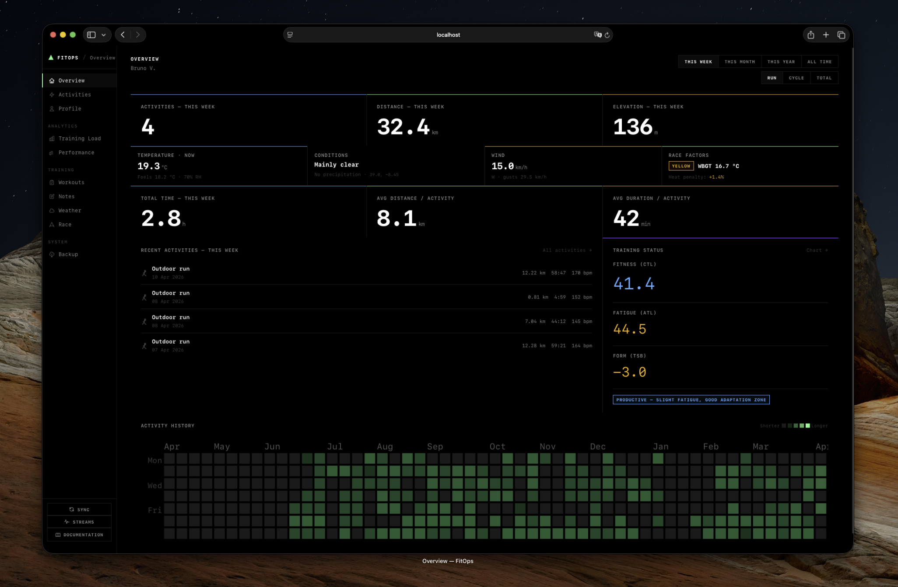

# Dashboard — Overview

The Overview is the first thing you see when you open the dashboard. It answers the question: *"Where am I right now in my training?"*

## Period & Sport Filter

Two controls at the top of the page shape everything on the screen:

- **Period** — This Week / This Month / This Year / All Time
- **Sport** — Run / Cycle / Total (all sports)

Change either and the stats, recent activity list, and load widget all update immediately.

## Stats Bar

A row of numbers summarising your training for the selected period and sport:

- **Activities** — how many sessions you've done
- **Distance** — total kilometres
- **Duration** — total moving time
- **Avg HR** — average heart rate across sessions
- **Avg Pace / Speed** — min/km for running, km/h for cycling
- **TSS** — combined Training Stress Score

## Training Load

A snapshot of today's fitness state:

- **CTL** (Chronic Training Load) — your long-term fitness base
- **ATL** (Acute Training Load) — how fatigued you are right now
- **TSB** (Training Stress Balance) — your form: positive means fresh, negative means carrying fatigue
- **Form label** — a plain-language read: *Fresh*, *Neutral*, *Accumulated Fatigue*, *Overreaching*

This widget reflects the same values as `fitops analytics training-load --today`. If it's empty, run `fitops analytics snapshot` once to seed the database.

## Recent Activities

Your 10 most recent sessions for the active period and sport filter. Each row shows the sport icon, date, name, distance, duration, pace or speed, heart rate, and TSS. Click an activity name to open it on Strava.

## Activity Heatmap

A calendar grid of all your training — one cell per day, shaded by how many activities you logged. Good for spotting gaps in your consistency or streaks you want to protect.

## Today's Weather

Auto-fetched using the coordinates of your most recent GPS activity. Shows:

- Temperature and "feels like"
- Humidity, precipitation chance
- Wind speed and direction
- Overall condition label
- **WBGT** (heat stress index) and its corresponding flag level
- **Pace heat factor** — how much to slow your target pace in the current conditions

This is the same weather data the CLI's `fitops weather forecast` uses.

## See Also

- [Analytics](./analytics.md) — full training load history as a chart
- [Activities](./activities.md) — your complete activity list
- [Concepts → Training Load](../concepts/training-load.md)
- [Concepts → Weather & Pace](../concepts/weather-pace.md)

← [Dashboard Overview](./index.md)
